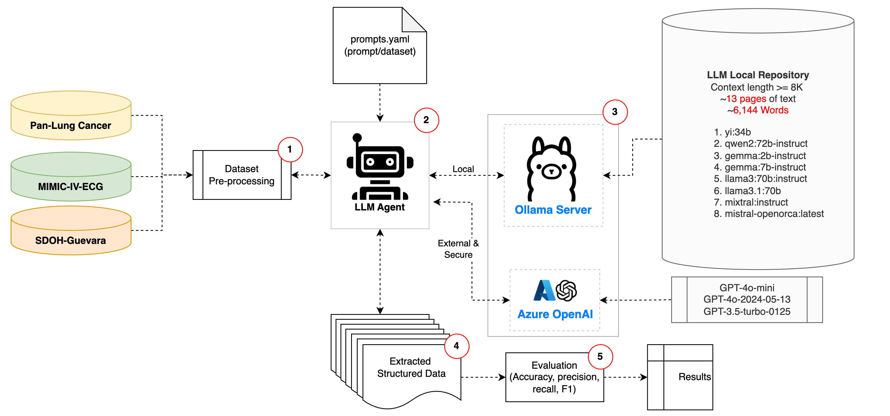
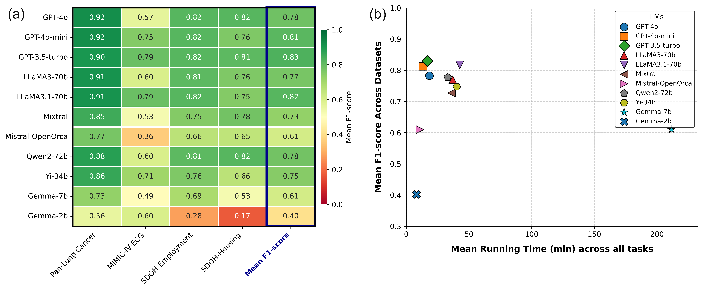

# ClinBench

**ClinBench**: A Standardized Multi-Domain Framework for Evaluating Large Language Models in Clinical Information Extraction

---

## Overview



**Figure:** ClinBench automated five-step benchmarking workflow showing data ingestion, prompt configuration, model inference, output validation, and evaluation.

ClinBench is an open-source benchmarking pipeline designed to systematically assess the performance and efficiency of large language models (LLMs) on structured information extraction tasks from unstructured clinical notes. It supports multi-domain evaluation (oncology, cardiology, social determinants of health) with a fully reproducible workflow covering:

1. **Data Ingestion**: Standardized CSV inputs for each clinical task.  
2. **Prompt Configuration**: Dynamic, YAML-based templates defining task instructions and JSON schemas.  
3. **Model Inference**: Unified agent for local (Ollama) and API-based LLM calls (OpenAI/Azure).  
4. **Output Validation**: JSON schema enforcement for robust, machine-readable outputs.  
5. **Evaluation**: Calculation of precision, recall, F1, specificity, accuracy, coverage, and runtime; optional confusion-matrix visualization.

---

## Key Features

- **Multi-Domain Tasks**:
  - Lung cancer staging (TCGA pathology reports)  
  - Atrial fibrillation detection (MIMIC-IV-ECG)  
  - Social determinants of health extraction (MIMIC clinical notes)

- **YAML-Driven Prompts**: External, version-controlled templates ensure consistency across models and tasks.  
- **Extensible Architecture**: Easily integrate new LLMs or datasets by adding YAML configs and dataset definitions.  
- **Performance-Efficiency Trade-Offs**: Empirical analysis of 11 LLMs across four extraction subtasks, reporting F1 vs. runtime.  
- **Post-Hoc Evaluation**: `evaluator.py` for summary metrics and confusion-matrix plots.

---

## Repository Structure
```
ClinBench/
├── run.sh                    # Shell wrapper to run all models across datasets
├── clinbench.py              # Main driver for data extraction using llmAgent
├── evaluator.py              # Evaluation script for predictions and metrics
├── prompts/                  # YAML prompt definitions per task
├── benchmark_data_definitions/
│   ├── tcga_lung/            # Lung dataset IDs
│   ├── mimic_ecg_af/         # ECG dataset IDs
│   └── mimic_sdoh/           # SDOH dataset IDs
├── requirements.txt          # Python dependencies
├── LICENSE                   # MIT License
├── README.md                 # Project overview and instructions
└── images/                   # Architecture diagram and sample plots
```

---

## Installation
1. **Clone the repository**
   ```bash
   git clone https://github.com/<username>/ClinBench.git
   cd ClinBench
   ```

2. **Create and activate a Python virtual environment**
   ```bash
   python3 -m venv .venv
   source .venv/bin/activate
   ```

3. **Install dependencies**
   ```bash
   pip install -r requirements.txt
   ```

---

## ClinBench: Configuration & Data Preparation Guide

This guide explains how to set up the necessary datasets to run the ClinBench benchmark tasks. ClinBench relies on publicly available (but often access-restricted) clinical datasets. The general workflow is:

1.  **Obtain Access & Download Original Datasets:** You will need to acquire access to the original TCGA, MIMIC-IV-ECG, and MIMIC-III datasets from their official sources. This often involves registration and agreeing to data use terms.
2.  **Use ClinBench Cohort Identifiers:** This repository provides CSV files containing lists of unique identifiers for the specific records/notes that make up each ClinBench benchmark task.
3.  **Prepare Benchmark Task Data:** You will use these identifier lists to select the relevant data from your locally downloaded original datasets and place them in a structure that ClinBench expects.
4.  **Run ClinBench:** Once the data is prepared, you can run the ClinBench.


## Configuration & Data Preparation

1. **Obtain Dataset Access**
   - TCGA Pan-Lung Cancer: cBioPortal credentialing  
   - MIMIC-IV-ECG & MIMIC-III: PhysioNet credentialing

2. **Populate `benchmark_data_definitions`**
   - Place cohort ID CSVs (`*.csv`) and ground-truth files in each dataset folder.

3. **Edit Placeholders** (optional)
   - Update file paths in `run_datasets.sh` if you deviate from the repository structure.

---

## Usage Examples

### 1. Run the Full Benchmark
**Ollama**
Use the shell script to iterate models over all datasets:
```bash
bash run_datasets.sh   http://localhost:8000 llama3.1:70b-8K
```

**OpenAI**
Use the shell script to iterate models over all datasets:
```bash
bash run_datasets.sh http://api.openai.com gpt-4o-mini
```

### 2. Direct Python Invocation
Run a specific model on one dataset type:
```bash
python extractData_v3.py   --base_url http://localhost:8000   --models llama3.1:70b-8K   --csv_file benchmark_data_definitions/tcga_lung/Lung_notes_id.csv   --prompts_yaml prompts/prompts.yaml   --results_path results/lung/   --dataset_type lung
```

### 3. Evaluate Predictions
Generate per-model metrics and confusion matrices:
```bash
python evaluator.py   --gt benchmark_data_definitions/tcga_lung/ground_truth_lung.csv   --preds_dir results/lung/   --out_dir eval/lung/   --features pT,pN,tumor_stage,histologic_diagnosis   --plot_cm
```

- Outputs: `<model>_results.csv`, `final_summary.csv`, and `cm_<model>_<feature>.png` (if `--plot_cm`).

---

## Cross-Task Performance & Efficiency Analysis



The cross-task analysis compares mean F1 scores versus mean runtime for 11 LLMs across four extraction tasks: Lung Cancer staging, Atrial Fibrillation detection, SDOH-Employment, and SDOH-Housing. Key observations:
- **GPT-3.5-turbo**, **GPT-4o-mini**, and **GPT-4o** achieve high mean F1 scores (0.81–0.83) with runtimes under 20 minutes, representing an optimal balance of accuracy and efficiency.
- Large open-source models like **LLaMA3.1-70b** attain similar F1 performance but have substantially longer runtimes (>40 minutes).
- This analysis underscores the need to weigh both extraction accuracy and computational cost when selecting models for clinical applications.

---

## License

This project is licensed under the MIT License. See `LICENSE` for details.

---

## Contact

Questions or feedback? Open an issue or contact Ismael Villanueva at ismaelvillanueva@gmail.com
